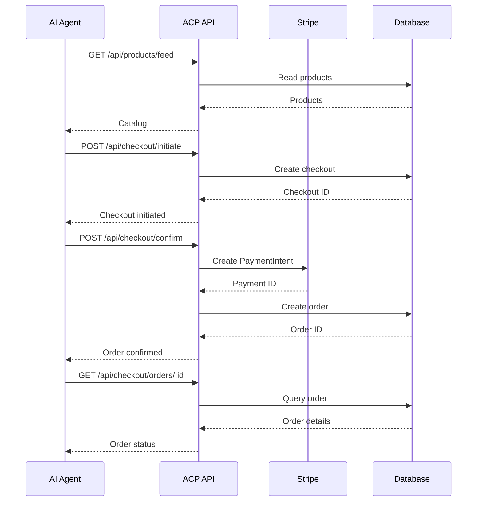

# 🛒 Agentic Commerce Protocol - POC

Complete Proof of Concept for OpenAI's **Agentic Commerce Protocol (ACP)**. This project demonstrates how to implement an e-commerce system that allows AI agents to make purchases autonomously.

## 📋 What is the Agentic Commerce Protocol?

The Agentic Commerce Protocol is an open-source standard developed by OpenAI that enables AI agents to interact with e-commerce platforms in a standardized way. It allows agents to:

- Query product catalogs
- Initiate checkout processes
- Complete transactions
- Track orders
- Receive status notifications

## ✨ POC Features

- ✅ **Product Feed API** - Product catalog with search
- ✅ **Checkout API** - Complete purchase process (initiate → confirm)
- ✅ **Stripe Integration** - PaymentIntents (test mode)
- ✅ **Order System** - Status management and tracking
- ✅ **Webhooks** - Status change notifications
- ✅ **Web Interface** - Interactive test UI
- ✅ **Persistence** - JSON file storage

## 🔧 Prerequisites

- **Node.js** v14 or higher
- **npm** v6 or higher
- **Stripe** account (test mode) - Optional for this POC

## 📦 Installation

### 1. Clone or navigate to directory

```bash
cd rtgPOC
```

### 2. Install dependencies

```bash
npm install
```

### 3. Configure environment variables

The `.env` file is already created with test values. If you want to use real Stripe:

1. Create an account on [Stripe](https://stripe.com)
2. Get your test API keys from [Stripe Dashboard](https://dashboard.stripe.com/test/apikeys)
3. Update the `.env` file:

```env
PORT=3000
STRIPE_SECRET_KEY=sk_test_YOUR_KEY_HERE
STRIPE_WEBHOOK_SECRET=whsec_YOUR_SECRET_HERE
MERCHANT_ID=merchant_poc_123
```

> **Note:** The POC works without real Stripe keys, simulating transactions.

## 🚀 Usage

### Start the Server

```bash
npm start
```

The server will start on `http://localhost:3000`

You'll see a message like this:

```
🚀 ACP POC Server started successfully

📍 Main URLs:
   Health Check:    http://localhost:3000/health
   Product Feed:    http://localhost:3000/api/products/feed
   Web Interface:   http://localhost:3000/test.html

✨ Agentic Commerce Protocol v1.0
🔧 Merchant ID: merchant_poc_123
```

### Test with Web Interface

1. Open your browser at `http://localhost:3000/test.html`
2. Use the buttons to:
   - View product catalog
   - Initiate a checkout
   - Confirm an order

### Test with cURL

#### 1. Get Product Feed

```bash
curl -X GET http://localhost:3000/api/products/feed
```

#### 2. Search Products

```bash
curl -X GET "http://localhost:3000/api/products/search?q=bluetooth"
```

#### 3. Get Specific Product

```bash
curl -X GET http://localhost:3000/api/products/prod_001
```

#### 4. Initiate Checkout

```bash
curl -X POST http://localhost:3000/api/checkout/initiate \
  -H "Content-Type: application/json" \
  -d '{
    "product_id": "prod_001",
    "quantity": 1,
    "buyer_info": {
      "name": "John Doe",
      "email": "john.doe@example.com",
      "address": {
        "street": "123 Main Street",
        "city": "New York",
        "country": "USA",
        "postal_code": "10001"
      }
    }
  }'
```

Save the `checkout_id` from the response for the next step.

#### 5. Confirm Order

```bash
curl -X POST http://localhost:3000/api/checkout/confirm \
  -H "Content-Type: application/json" \
  -d '{
    "checkout_id": "chk_XXXXXXXX-XXXX-XXXX-XXXX-XXXXXXXXXXXX",
    "payment_method": "card"
  }'
```

#### 6. Query Checkout Status

```bash
curl -X GET http://localhost:3000/api/checkout/chk_XXXXXXXX-XXXX-XXXX-XXXX-XXXXXXXXXXXX/status
```

#### 7. Query Order

```bash
curl -X GET http://localhost:3000/api/checkout/orders/ord_XXXXXXXX-XXXX-XXXX-XXXX-XXXXXXXXXXXX
```

#### 8. Send Update Webhook

```bash
curl -X POST http://localhost:3000/api/webhooks/order-updates \
  -H "Content-Type: application/json" \
  -d '{
    "order_id": "ord_XXXXXXXX-XXXX-XXXX-XXXX-XXXXXXXXXXXX",
    "event_type": "shipped",
    "data": {
      "tracking_number": "TRACK123456"
    }
  }'
```

## 📁 Project Structure

```
rtgPOC/
├── server.js                 # Main Express server
├── routes/
│   ├── products.js          # Products API (GET feed, search, etc.)
│   ├── checkout.js          # Checkout API (initiate, confirm, status)
│   └── webhooks.js          # Webhooks API (notifications)
├── data/
│   ├── products.json        # 3 example products catalog
│   └── orders.json          # Checkouts and orders (generated dynamically)
├── public/
│   └── test.html            # Web test interface
├── .env                     # Environment variables
├── .gitignore
├── package.json
└── README.md
```

## 🔌 API Endpoints

### Product Feed API

| Endpoint | Method | Description |
|----------|--------|-------------|
| `/api/products/feed` | GET | Get complete catalog |
| `/api/products/:id` | GET | Get specific product |
| `/api/products/search?q=query` | GET | Search products |

### Checkout API

| Endpoint | Method | Description |
|----------|--------|-------------|
| `/api/checkout/initiate` | POST | Initiate checkout process |
| `/api/checkout/confirm` | POST | Confirm and process payment |
| `/api/checkout/:id/status` | GET | Query checkout status |
| `/api/checkout/orders/:id` | GET | Get order details |

### Webhooks API

| Endpoint | Method | Description |
|----------|--------|-------------|
| `/api/webhooks/order-updates` | POST | Receive status notifications |
| `/api/webhooks/events/:order_id` | GET | Order event history |

## 📊 Complete Purchase Flow



## 🧪 Test Data

### Available Products

1. **prod_001** - Bluetooth Headphones Pro ($79.99)
2. **prod_002** - Sports Backpack ($45.00)
3. **prod_003** - RGB Mechanical Keyboard ($129.99)

### Automatic Calculations

- **Tax:** 8% of subtotal
- **Shipping:** $5.99 fixed
- **Total:** Subtotal + Tax + Shipping

### Checkout States

- `initiated` - Checkout created, pending confirmation
- `completed` - Checkout completed, order created
- `expired` - Checkout expired (30 minutes)

### Order States

- `confirmed` - Order confirmed
- `shipped` - Order shipped
- `delivered` - Order delivered
- `cancelled` - Order cancelled

## 🚀 Next Steps for Production

To take this POC to production, consider:

1. **Real Database**
   - Migrate from JSON to PostgreSQL/MongoDB
   - Implement ACID transactions
   - Add indexes and optimizations

2. **Authentication and Security**
   - Implement OAuth 2.0
   - API Keys for merchants
   - Rate limiting
   - HTTPS/TLS

3. **Complete Stripe**
   - Webhook signing verification
   - Refund handling
   - Multiple payment methods
   - Dynamic currencies

4. **Real Inventory**
   - Stock management system
   - Temporary reservations during checkout
   - Low stock notifications

5. **Notifications**
   - Transactional email
   - SMS updates
   - Push notifications

6. **Monitoring**
   - Structured logging (Winston, Bunyan)
   - APM (Application Performance Monitoring)
   - Error tracking (Sentry)
   - Metrics (Prometheus, Grafana)

7. **Testing**
   - Unit tests (Jest)
   - Integration tests
   - E2E tests (Playwright)
   - CI/CD pipeline

8. **Scalability**
   - Load balancing
   - Caching (Redis)
   - Queue system (Bull, RabbitMQ)
   - Microservices

## 📚 Useful Links

- **Official ACP Repository:** [github.com/agentic-commerce-protocol](https://github.com/agentic-commerce-protocol/agentic-commerce-protocol)
- **OpenAI Documentation:** [developers.openai.com/commerce](https://developers.openai.com/commerce)
- **Stripe Docs:** [docs.stripe.com/agentic-commerce](https://docs.stripe.com/agentic-commerce)
- **Stripe Test Cards:** [docs.stripe.com/testing](https://docs.stripe.com/testing)

## 🤝 Contributing

This is a POC for demonstration and learning purposes. Feel free to:

- Fork the project
- Experiment with the code
- Add new features
- Report issues or improvements

## 📄 License

MIT License - Free to use and modify

---

**Developed with ❤️ as a POC for the Agentic Commerce Protocol**

For questions or support: [your-email@example.com]
